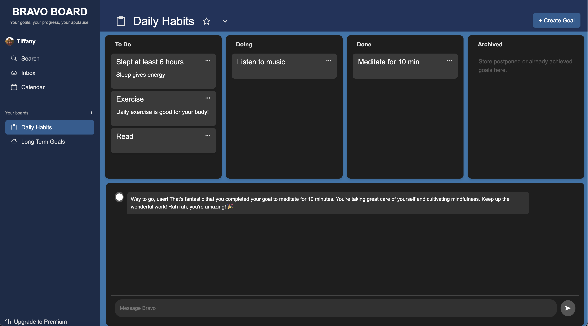

# 🎉 Bravo Board: Celebrate Your Goals Like Never Before!

**Author**: Tiffany Yang  
**Date**: November 21, 2024

---

## **Overview**

Bravo Board isn’t just a goal tracker; it’s your personal cheerleader. It’s designed to help you **organize, track, and celebrate** your achievements—whether big or small. From the moment you mark a goal as complete, Bravo Board’s AI-powered cheerleader is ready to applaud your efforts with motivational, personalized messages.

Life gets busy, but every milestone deserves recognition. That’s where Bravo Board shines, offering a seamless and celebratory experience for managing your tasks and goals across categories like **Daily Habits**, **Long-Term Goals**, and even archived accomplishments.

---

## **Why Bravo Board?**

Unlike traditional task managers, Bravo Board takes a celebratory approach. The app doesn’t just help you check things off a list—it actively motivates you to keep going by:

- **Recognizing Your Efforts**: AI-generated cheers for every completed goal.
- **Making Progress Visible**: Move tasks across customizable boards with drag-and-drop ease.
- **Keeping It Fun**: A sleek and user-friendly interface that makes managing goals feel rewarding.

Here’s your chance to not just _do the work_, but truly **own the applause** you deserve.

---

## **Screenshot**

  
_Your goals, your progress, your applause!_

🎥 **Watch the Demo Here:** [Bravo Board Demo Video](https://youtu.be/8_BS6H5Zn-I)

---

## **UI/UX Design Research & Motivation**

The design of Bravo Board was heavily influenced by real-world feedback and market research. Here’s what went into making the experience exceptional:

### **User Interviews**

The author conducted **two in-depth user interviews** to understand how people currently manage their goals and what they find most rewarding. Key insights included:

- People feel disconnected from their goals when apps focus solely on “to-do” lists without positive reinforcement.
- Users wanted a **celebratory element** that feels authentic and motivational.

### **Competitor Analysis**

The author also researched popular goal and task management apps such as Trello, Todoist, Ticktick, Habits Tracker, analyzing strengths and weaknesses to build something truly unique. Observations included:

- Many apps are designed to be simple with intuitive user interfaces, and offer more advanced features to help users personalize further.
- However, few, if any, apps incorporated **emotional rewards** for goal completion.

### **Result**

Bravo Board is the perfect blend of simplicity, emotional connection, and functionality—making it a joy to use.

---

## **Core Features**

- **Celebrate Every Win**: Receive motivational AI-generated messages every time you complete a goal.
- **Seamless Organization**: Drag and drop tasks across **To Do**, **Doing**, **Done**, and **Archived** boards.
- **Custom Boards**: Manage tasks in both Daily Habits and Long-Term Goals categories.
- **Intuitive Design**: A clean and responsive UI that works effortlessly on any device.
- **Backend Powerhouse**: Built on a robust Flask and PostgreSQL backend.

---

## **Technologies Used**

### **Frontend**

- React, Bootstrap, CSS Modules

### **Backend**

- Flask, Flask-Restx, SQLAlchemy

### **Database**

- PostgreSQL

---

## **Setup Instructions**

To get started with Bravo Board on your local machine:

1. **Clone the repository**:

   ```bash
   git clone https://github.com/yourusername/bravo-board.git
   cd bravo-board
   ```

2. **Set up a Python virtual environment** (using Pipenv):

   ```bash
   pip install pipenv
   pipenv shell
   ```

3. **Install backend dependencies**:

   ```bash
   cd backend
   pipenv install
   ```

4. **Install frontend dependencies**:

   ```bash
   cd ../frontend
   npm install
   ```

5. **Start the application**:
   - **Backend**:
     ```bash
     flask run
     ```
   - **Frontend**:
     ```bash
     npm start
     ```

---

## **Repository Structure**

```
bravo-board/
├── backend/               # Flask backend
│   ├── app/               # Application logic
│   ├── models.py          # Database models
│   ├── routes/            # API endpoints
│   └── config.py          # Configuration for development, testing, and production
├── frontend/              # React frontend
│   ├── components/        # React components
│   ├── styles/            # CSS styles
│   └── App.js             # Main React app file
├── assets/                # Static assets (e.g., images, logos)
└── README.md              # Documentation
```

---

## **API Endpoints**

### **Goals**

- **`GET /goals/goals`**  
  Fetch all goals, sorted by their `order` field.

- **`POST /goals/goals`**  
  Create a new goal. Requires a JSON body with `title` (required), `description`, and optional `status`.

- **`GET /goals/goal/<id>`**  
  Fetch a specific goal by its ID.

- **`PUT /goals/goal/<id>`**  
  Update an existing goal by its ID. Accepts a JSON body with optional fields to update (`title`, `description`, `status`, `order`).

- **`DELETE /goals/goal/<id>`**  
  Delete a goal by its ID.

- **`PUT /goals/order`**  
  Batch update the order and status of multiple goals. Accepts a JSON array of goal objects with `id` and optional `status`.

---

## **Future Features**

Here’s what’s next on the horizon for Bravo Board:

- 🌟 **Favorites**: Pin your favorite boards for quick access.
- ✏️ **Rename Boards**: Customize board names to fit your workflow.
- 🔄 **Move Tasks Across Boards**: Seamlessly transfer tasks between boards.
- 🤖 **Personalized Cheerleader AI**: Tailor motivational messages to your style.
- 👤 **Profile Page**: Track stats, milestones, and more.
- ➕ **Add New Boards**: Create as many boards as you need for different aspects of your life.
- 🧩 **Add New Columns**: Expand your workflow with custom column categories.
- 🎨 **Custom Themes**: Personalize your Bravo Board with color and design options.

---

Bravo Board isn’t just about getting things done—it’s about celebrating your wins, staying motivated, and enjoying the journey. Ready to start managing your goals with a cheerleader by your side? Bravo Board is here to make it happen!
